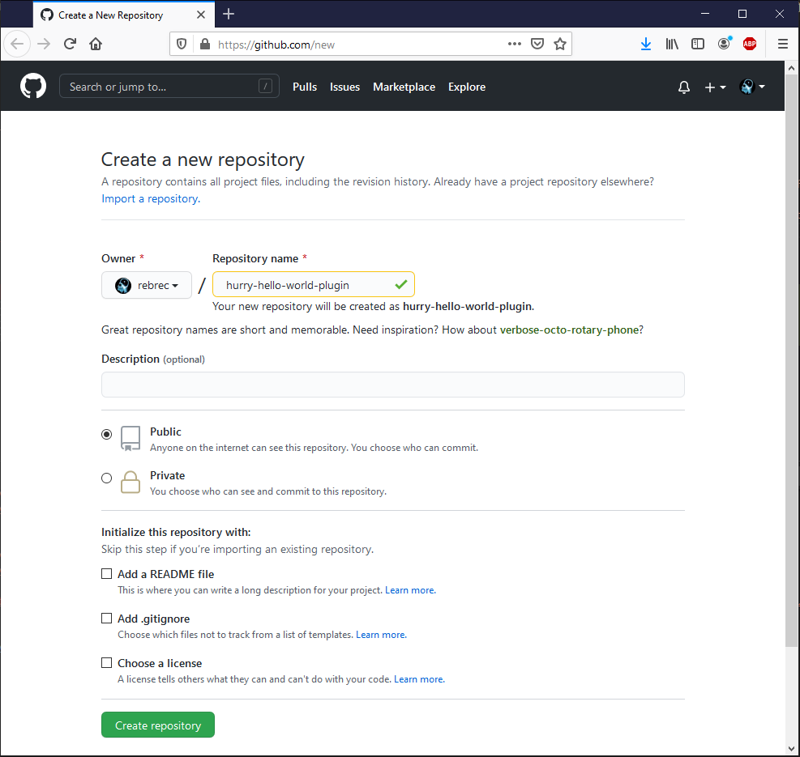
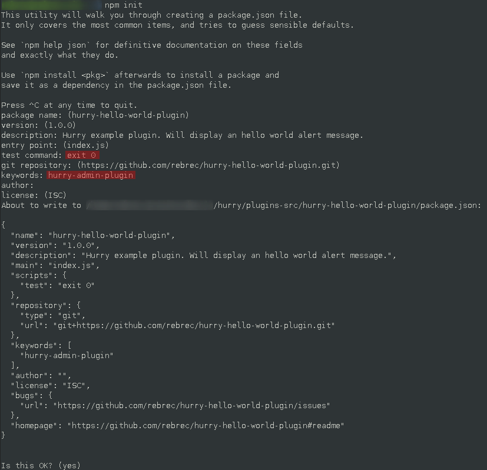
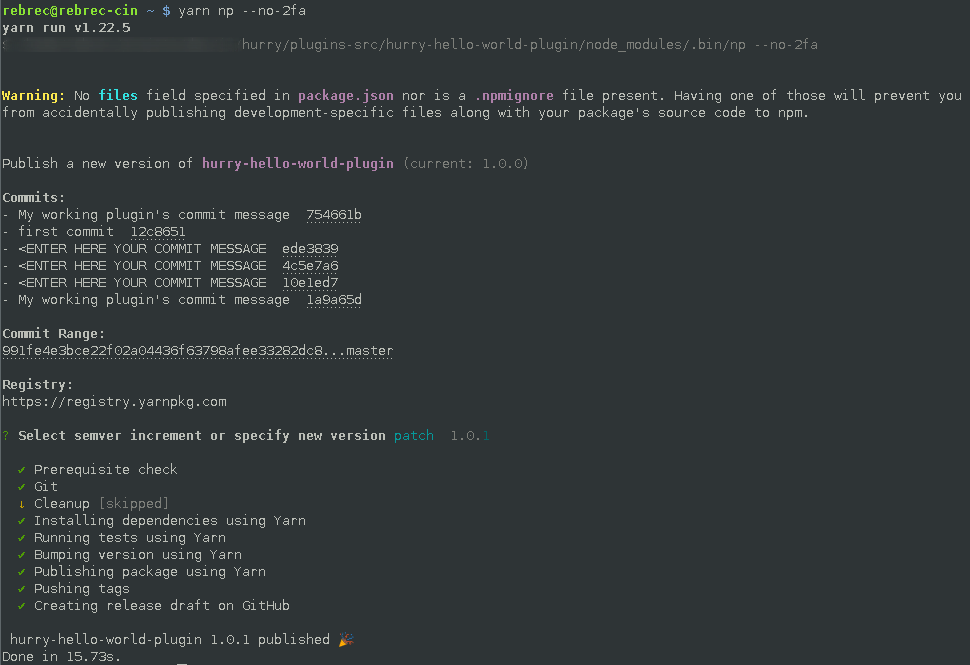

# Creation of your First plugin

We will create a very simple Hello World plugin which will display **Hello World** when hurry start.

The goal is mainly to demonstrate where to create the plugin, where to put the code and how to build the plugin.

more complex examples will follow in this documentation.

Plugin's ultimate goal is to be shareable. They can be published to the npm registry so that Hurry can easily
find and install them.

For a plugin to be published you will have to host it on a public git repository.

We consider that you will know how to create a GitHub account and a new GitHub repository.

## Prerequisite

To ease the publishing of plugins, we are used to use a command line tool used to interact with GitHub's API.

This tool is called **hub** and can be downloaded from [here](https://github.com/github/hub)

It is not necessary to use it but will ease your daily life if you want to often create new GitHub repositories
to hold your plugins's source code.

## Plugin location

During development, you will create your custom plugins within the *plugin-src* subfolder at the root of Hurry source code.

Each plugin is self-contained within a folder named as the plugin name.


### Choose a plugin Name

You will first have to **choose a plugin name**. 

Published plugins are stored on the [npmjs registry](https://www.npmjs.com/search?q=keywords%3Ahurry-admin-plugin).

Since this registry has a huge list of packages already available you may encounter a conflict when trying to publish your first plugin.

To be able to share it with others, you will have to choose a unique name.
For this purpose, a good idea is to **prefix your plugin name with 'hurry-'**.

To have a list of already used plugins you can get a list from [npmjs search engine](https://www.npmjs.com/search?q=keywords%3Ahurry-admin-plugin)

For the current exercise we will name our plugin **hurry-hello-world-plugin**

## Structure creation

### Folder

First, let's create our plugin's folder.

From a command prompt, create a folder named **hurry-hello-world-plugin** within the **plugin-src** folder

```bash
cd <HURRY_PROJECT_ROOT>
cd plugin-src
mkdir hurry-hello-world-plugin
cd hurry-hello-world-plugin
```


### GitHub Repository

Now create a repository to track our plugin's source code by going to [this link](https://github.com/new):



Enter the name of your plugin as a **Repository name** and click on **Create repository** button.

Then initialize your empty repository and add the remote repository address 

```bash
echo "# hurry-hello-world-plugin" >> README.md
git init
echo "node_modules" >> .gitignore
echo ".npm" >> .gitignore
echo ".config" >> .gitignore
git add README.md .gitignore
git commit -m "first commit"
git branch -M master
git remote add origin git@github.com:rebrec/hurry-hello-world-plugin.git
git push -u origin master
```

### Initialize the npm package

Then initialize the npm package by using the command `npm init`

You can answer most questions by just hitting *Enter* to choose default choice. **Except** for the below ones:

- Test: you must provide a test command whose return code is 0 when success. If you don't have unit tests yet, you can type `exit 0`
- Keywords: you **must** provide at least the keyword **hurry-admin-plugin**. This required so that hurry's plugin install will be able to list this plugin as an available hurry plugin.



### Add the necessary node modules

A few mandatory modules need to be added:

- **hurry-plugin-definition**: it will provide some necessary classes that your plugin will inherits.
- **np**: this package will make publishing your module easy. While not mandatory, you may consider installing it as a dev dependency even if you don't need it yet. Later you will be happy to have it already available. To read more about it have a look at the [official page](https://github.com/sindresorhus/np)

To install both of them, simply type the following :

```
yarn add -D np
yarn add hurry-plugin-definition
```

## Let's write the code!

It's time to write the plugin's code.

Create a file **index.js** within the plugin directory and write the following inside it:

```js
import Plugin from 'hurry-plugin-definition'

export default class HelloWorldPlugin extends Plugin{
    constructor(api, context){
        super(api, context);
        alert('Hello World!');
    }
} 
```

## Build it
To test our freshly created plugin we will have to build it.

We provide a script to build plugins. This script will rebuilt plugins each time a file is modified so you can do live code.

To run the script type the following **from Hurry root folder** (Please note that you must not type this command from the plugin directory!)

```bash
yarn buildplugins
```

**There is currently no other way to stop this script so feel free to terminate it when needed by hitting Ctrl+C !**

## Run it

It's time to run Hurry and test our new plugin.

To run Hurry by typing `yarn start` **from Hurry root folder** (Please note again, that you must not type this command from the plugin directory!)

After building it's stuff, Hurry will start and display a nice "Hello World!" alert message !

Congratulation! Your first Plugin works!.

## Save and Publish!

### Save

Now that your plugin works, you may consider commiting your changes to your git repository. So from the plugin's directory enter:

```bash
git add .
git commit -m "<ENTER HERE YOUR COMMIT MESSAGE"
git push origin master
```

### Publish

Run `yarn np --no-2fa` from the plugin's directory and follow the instructions.

The first time you run this command, you will have to login to the npm registry. If not done yet, you will need to [create an account](https://www.npmjs.com/signup)

Each time you want to publish a new release of your plugin, you will just have to type the following commands:

```bash
git add .
git commit -m "<ENTER HERE YOUR COMMIT MESSAGE"
git push origin master
yarn np --no-2fa
```



